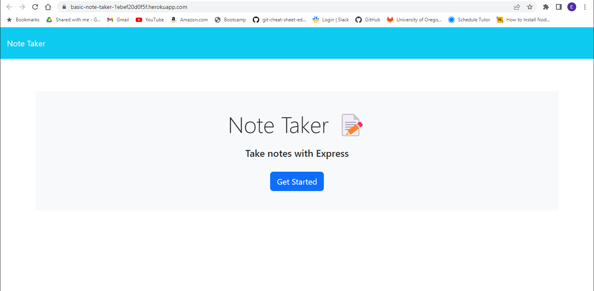
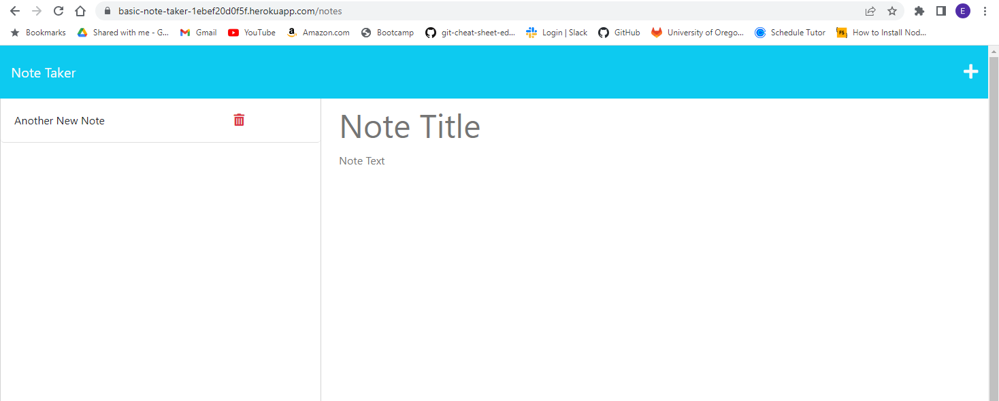

# Note-Taker
Displays previously saved notes, saves new notes, allows user to delete notes when no longer needed.

## Description

I built this project in order to practice using Express.js. It solves the problem of having to utlize local storage to create/display persistent data, as the data is stored in a json file instead. I learned about middleware usage, generic helper functions, how to create routes for getting/posting/deleting data, wildcard routes, and how to connect front-end javascript to back-end files. I also learned how to test my project with Insomnia.

This project can be found here:

https://basic-note-taker-1ebef20d0f5f.herokuapp.com

## Table of Contents

- [Installation](#installation)
- [Usage](#usage)
- [Tests](#tests)

## Installation

You will need to install Node.js and Express.js. 

Instructions for installating Node.js can be found here: https://coding-boot-camp.github.io/full-stack/nodejs/how-to-install-nodejs 

Express.js can be installed by typing "npm install express" into the terminal command line.

## Usage

This project can be used to test api routes to add, update, and delete data with Express.js. A new note title can be typed into the Note Title field, a new note can be typed into the Note Text field, and after the save icon in the upper-right corner is clicked, the note will be saved to the left column. The notes in the left column can be clicked to display them as read-only on the right, and the + symbol in the upper-right can be clicked to add another note. Saved notes can be deleted by clicking the trash can icon next to them.

## Tests

This project can be tested by running the GET/POST/DELETE routes in Insomnia. Insomnia can be downloaded here: https://insomnia.rest/
